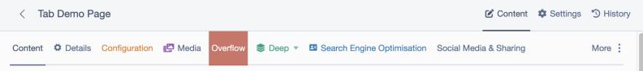
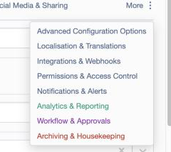
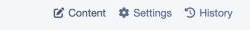
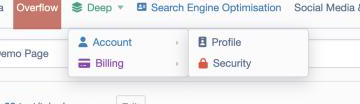
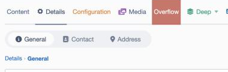

# Silverstripe Better Tabs

Tame CMS forms that have too many tabs. When a tabset's tab bar would wrap onto more than
one row, the overflowing tabs collapse into a **"More ▾"** dropdown so the bar stays on a
single row. The active tab is always kept visible.

Works with the tabs you already have — including **nested tabs**
(`addFieldToTab('Root.Tab.SubTab', $field)`), which Silverstripe supports out of the box.



## Requirements

- Silverstripe Framework **6** / Admin **3**
- PHP **8.3+**

## Installation

```bash
composer require xddesigners/silverstripe-better-tabs
```

Run `dev/build?flush=1` once. No configuration or code changes are needed — it enhances the
existing CMS tab bars automatically.

## How it works

The module adds a small CSS + JS enhancement to the CMS (via
`LeftAndMain.extra_requirements_javascript` / `_css`). The script:

- watches each `.ss-tabset > ul.nav-tabs`; when it wraps, it hides the trailing tabs and lists
  them in a "More ▾" dropdown (keeping the active tab visible, and flagging "More" when the
  active tab lives inside it);
- leaves the tabs' native click behaviour intact — the real tab elements stay in the DOM
  (just hidden) and the dropdown proxies clicks to them;
- re-applies on window/panel resize (`ResizeObserver`) and after the CMS swaps in new content
  via PJAX (`MutationObserver`).

It is dependency-free (no jQuery/entwine required) and makes no server-side or data changes.



The overflow menu is on by default. If you only want the other features (icons, colours,
dropdown mode, breadcrumb) and would rather leave the tab bar native, turn it off in YAML:

```yaml
XD\BetterTabs\BetterTabs:
  overflow_menu: false
```

## Tab icons & colours

All configured in **PHP**, in `getCMSFields()` — no YAML per tab. Every setter returns the
field, so they chain:

```php
$fields->fieldByName('Root.Deep')
    ->setMode('dropdown')
    ->setIcon('fa-solid fa-layer-group')
    ->setColor('#16a085');
```

### Icons

Give any tab an icon with `setIcon()`. Use a built-in CMS `font-icon` name (without the
`font-icon-` prefix):

```php
$fields->fieldByName('Root.Main')->setIcon('block-content');   // a leaf Tab (native)
$fields->fieldByName('Root.Settings')->setIcon('cog');         // a TabSet (tab group)
```

`Tab::setIcon()` is built into Silverstripe; this module adds the same to **`TabSet`** so a
tab *group* can have an icon too. Icons are vertically aligned with the label and carried into
the overflow dropdown.

### Font Awesome icons

Pass Font Awesome classes to `setIcon()`:

```php
$fields->fieldByName('Root.Media')->setIcon('fa-solid fa-photo-film');
```

Enable Font Awesome in the CMS from your project YAML (e.g. `app/_config/better-tabs.yml`):

```yaml
XD\BetterTabs\BetterTabs:
  # Font Awesome Free (loaded from cdnjs):
  include_fontawesome_free: true

  # …or Font Awesome Pro — point at your own kit/CSS and use Pro classes (fa-thin, fa-duotone, …):
  # fontawesome_css: 'https://kit.fontawesome.com/XXXX.css'
```

### Colours

Colour a tab's label (and optionally its background):

```php
$fields->fieldByName('Root.Alerts')->setColor('#ffcc00');            // text colour
$fields->fieldByName('Root.Live')->setColor('#ffffff', '#c0392b');   // text + background
$fields->fieldByName('Root.Live')->setIconColor('#2ecc71');          // colour just the icon
```

Works on both leaf Tabs and TabSets, at every level and in the overflow dropdown (text, icon
and background colours all propagate). A tab given a background colour fades slightly while
inactive, so the selected tab stays obvious.

## Icons on the CMS view tabs

The edit-form view tabs (Content / Settings / History, and the like) aren't `Tab`/`TabSet`
fields, so `setIcon()` can't reach them. Give them icons with a small YAML map — each key is
matched against a path segment of the tab's link:

```yaml
XD\BetterTabs\BetterTabs:
  view_tab_icons:
    edit: 'edit-write'                       # Content  — a CMS font-icon…
    settings: 'cog'                          # Settings
    history: 'fa-solid fa-clock-rotate-left' # History  — …or Font Awesome
```



## Sub-tabs as a dropdown

By default a tab group's sub-tabs render as an inline segmented pill bar. For a group with
many (or deeply nested) sub-tabs you can instead turn it into a website-style **dropdown
menu**: the group's own tab gets a ▾ caret and, on hover/click, opens a menu of its sub-tabs
(groups nested inside open as flyout submenus). All of that group's in-body sub-tab bars are
hidden — navigation happens through the menu, which keeps deep forms tidy. Opt in **per tab
group**, in PHP:

```php
$fields->fieldByName('Root.Deep')->setMode('dropdown'); // or ->enableDropdown()
```

`setMode('pills')` (the default) switches it back. Only the group you mark changes; every other
tabset keeps the pill bar. Flyouts open to the right, flipping left only when short on space.
Pairs well with the breadcrumb.



## Theming (CSS variables)

The module's default colours are CSS custom properties — override any of them in your admin
CSS (each falls back to the matching Bootstrap/CMS variable):

```css
:root {
    --bt-track-bg: #f0f1f3;         /* nested sub-tab track */
    --bt-tab-color: #5b6168;        /* inactive sub-tab text */
    --bt-tab-hover-color: #1a1a1a;
    --bt-tab-active-bg: #ffffff;    /* selected sub-tab */
    --bt-tab-active-color: #1a1a1a;
    --bt-icon-color: inherit;       /* global tab-icon colour */
    --bt-inactive-opacity: 0.72;    /* fade for coloured tabs while inactive */
    --bt-dropdown-bg: #ffffff;
    --bt-dropdown-color: #212529;
    --bt-dropdown-border: rgba(0, 0, 0, 0.15);
    --bt-dropdown-hover-bg: rgba(0, 0, 0, 0.06);
}
```

## Breadcrumb for deep tabs

For tabsets nested two or more levels deep, you can show a breadcrumb of the active path
(e.g. "Deep › Account › Profile"), rendered just below the deepest sub-tab strip. The crumbs
are clickable — selecting one jumps to that tab (resetting the levels below it to their first
tab, like clicking the tab itself would).

Enable it per form in `getCMSFields()`:

```php
$fields->fieldByName('Root')->enableBreadcrumbs();
```

…or globally for every CMS form, in your project YAML:

```yaml
XD\BetterTabs\BetterTabs:
  breadcrumbs: true
```



## Translations

The "More" overflow label is translatable via Silverstripe i18n, shown in the CMS user's
locale. Translations ship for **en, nl, de, it, es, fr** (`lang/<locale>.yml`).

## License

BSD-3-Clause.
